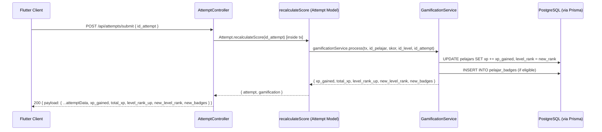

# Design Document: Gamifikasi LogiLearn

## Overview

Fitur gamifikasi LogiLearn menambahkan empat komponen inti ke aplikasi yang sudah berjalan: sistem XP, Level Rank otomatis, Badge pencapaian, dan Leaderboard berbasis XP. Semua pembaruan dipicu satu kali setelah `POST /api/attempts/submit` berhasil menghitung ulang skor attempt.

Seluruh logika gamifikasi diimplementasikan sebagai **Gamification Service** baru di layer service Express.js. Service ini dipanggil di dalam satu transaksi Prisma yang sama dengan kalkulasi skor, sehingga atomisitas terjamin. Flutter client membaca hasilnya dari response body `submit` yang diperluas, dan memanggil dua endpoint baru untuk stats dan badges.

---

## Architecture

### High-Level Flow



### Layer Structure

```
src/
  services/
    gamificationService.js   ← NEW: logika XP, rank, badge
  controllers/
    attemptController.js     ← MODIFIED: panggil gamificationService setelah recalculate
    leaderboardController.js ← NEW: global leaderboard + per-level
    pelajarController.js     ← MODIFIED: tambah /stats dan /badges
  models/
    attempt.js               ← MODIFIED: recalculateScore dikembalikan ke tx-aware
    gamification.js          ← NEW: query helper XP/badge
  routes/
    attemptRoutes.js         ← MODIFIED: route /submit sudah ada
    leaderboardRoutes.js     ← NEW
    pelajarRoutes.js         ← MODIFIED: tambah /stats dan /:id/badges
```

---

## Components and Interfaces

### 1. GamificationService (`src/services/gamificationService.js`)

Satu fungsi utama dipanggil dari dalam transaksi Prisma:

```js
/**
 * @param {import('@prisma/client').Prisma.TransactionClient} tx
 * @param {number} id_pelajar
 * @param {number} skor          - skor persentase attempt (0–100)
 * @param {number} id_level
 * @param {number} id_attempt
 * @returns {Promise<GamificationResult>}
 */
async function process(tx, id_pelajar, skor, id_level, id_attempt)
```

**GamificationResult shape:**
```js
{
  xp_gained: number,      // 0–100, floor(skor * 1.0)
  total_xp: number,       // XP kumulatif setelah update
  level_rank_up: boolean,
  new_level_rank: number, // 1–5
  new_badges: Badge[]     // badge baru yang diperoleh sesi ini
}
```

**Internal helpers (pure functions, testable):**

```js
// Hitung XP dari skor
function calculateXp(score)          // → number (0–100)

// Tentukan level rank dari total XP
function determineRank(totalXp)      // → number (1–5)

// Evaluasi badge mana yang baru diperoleh
function evaluateBadges(context)     // → string[] (badge criteria_type list)
```

**`evaluateBadges` context shape:**
```js
{
  skor: number,
  total_xp: number,
  id_level: number,
  id_pelajar: number,
  existingBadgeTypes: string[],   // badge yg sudah dimiliki
  isFirstPerfectScore: boolean,   // skor=100, belum pernah sebelumnya
  isFirstPassOnLevel: boolean     // skor≥75 first time di level ini
}
```

### 2. Modified `Attempt.recalculateScore`

Diubah menjadi transaction-aware dan mengembalikan hasil gamifikasi:

```js
static async recalculateScoreWithGamification(id_attempt)
// Membuka prisma.$transaction, memanggil gamificationService.process di dalam tx
// Mengembalikan { attempt, gamification: GamificationResult }
```

Fungsi lama `recalculateScore` tetap ada agar backward-compatible dengan tests.

### 3. Leaderboard Controller (`src/controllers/leaderboardController.js`)

| Fungsi | Endpoint | Deskripsi |
|---|---|---|
| `getGlobalLeaderboard` | `GET /api/leaderboard` | Top-50 by xp, mendukung ?page=&limit= |
| `getLevelLeaderboard` | `GET /api/leaderboard?level_id={id}` | Top-10 per level by avg score |

### 4. Extended Pelajar Controller

| Fungsi | Endpoint | Deskripsi |
|---|---|---|
| `getStats` | `GET /api/pelajar/:id/stats` | total_xp, level_rank, total_badges, global_rank |
| `getBadges` | `GET /api/pelajar/:id/badges` | Semua badge milik pelajar |

### 5. Response Wrapper

Response helper yang ada (`src/helpers/response.js`) digunakan tanpa perubahan. Semua endpoint baru mengikuti pola `{ payload: { statusCode, datas, message }, pagination: {...} }`.

---

## Data Models

### Perubahan Prisma Schema

```prisma
model pelajars {
  id           Int             @id @default(autoincrement())
  nama         String
  username     String
  password     String
  xp           Int             @default(0)          // NEW
  level_rank   Int             @default(1)          // NEW
  attempts     attempts[]
  pelajar_badges pelajar_badges[]                   // NEW relation
}

model attempts {
  id         Int      @id @default(autoincrement())
  id_level   Int
  id_pelajar Int
  skor       Float
  created_at DateTime @default(now())              // NEW
  // ... relasi yang sudah ada tetap sama
}

model badges {                                     // NEW TABLE
  id             Int              @id @default(autoincrement())
  name           String           @unique
  description    String
  criteria_type  String           // "PERFECT_SCORE" | "FIRST_PASS" | "XP_1000" | "XP_5000"
  pelajar_badges pelajar_badges[]
}

model pelajar_badges {                             // NEW TABLE
  id          Int      @id @default(autoincrement())
  id_pelajar  Int
  id_badge    Int
  obtained_at DateTime @default(now())
  pelajars    pelajars @relation(fields: [id_pelajar], references: [id], onDelete: Cascade)
  badges      badges   @relation(fields: [id_badge], references: [id], onDelete: Cascade)

  @@unique([id_pelajar, id_badge])
  @@index([id_pelajar])
}
```

### Badge Seed Data

```js
// prisma/seed.js (atau migration manual)
const BADGES = [
  { name: 'Skor Sempurna',     description: 'Raih skor 100 untuk pertama kalinya', criteria_type: 'PERFECT_SCORE' },
  { name: 'Lulus Pertama Kali', description: 'Lulus (skor ≥ 75) di sebuah level untuk pertama kalinya', criteria_type: 'FIRST_PASS' },
  { name: 'Pelajar Rajin',     description: 'Kumpulkan total XP ≥ 1000', criteria_type: 'XP_1000' },
  { name: 'Pejuang XP',        description: 'Kumpulkan total XP ≥ 5000', criteria_type: 'XP_5000' },
];
```

### Level Rank Threshold Table

| Rank | Nama   | Total_XP min | Total_XP max |
|------|--------|-------------|-------------|
| 1    | Pemula | 0           | 499         |
| 2    | Pelajar| 500         | 1499        |
| 3    | Mahir  | 1500        | 2999        |
| 4    | Ahli   | 3000        | 5999        |
| 5    | Master | 6000        | ∞           |

### API Response Shapes

**`POST /api/attempts/submit` (extended)**
```json
{
  "payload": {
    "statusCode": 200,
    "datas": {
      "id": 42,
      "skor": 80.0,
      "xp_gained": 80,
      "total_xp": 1080,
      "level_rank_up": true,
      "new_level_rank": 3,
      "new_badges": [
        { "name": "Pelajar Rajin", "description": "Kumpulkan total XP ≥ 1000" }
      ]
    },
    "message": "Attempt berhasil disubmit"
  },
  "pagination": { "prev": "", "next": "", "max": "" }
}
```

**`GET /api/leaderboard`**
```json
{
  "payload": {
    "statusCode": 200,
    "datas": [
      { "rank": 1, "id": 5, "nama": "Budi", "total_xp": 3200, "level_rank": 4 }
    ],
    "message": "Leaderboard berhasil dimuat"
  },
  "pagination": { "prev": "", "next": "", "max": "50" }
}
```

**`GET /api/leaderboard?level_id=2`**
```json
{
  "payload": {
    "statusCode": 200,
    "datas": [
      { "rank": 1, "id": 3, "nama": "Ani", "average_score": 95.5, "total_attempts": 2 }
    ],
    "message": "Leaderboard level berhasil dimuat"
  }
}
```

**`GET /api/pelajar/:id/stats`**
```json
{
  "payload": {
    "statusCode": 200,
    "datas": {
      "id": 7,
      "nama": "Sari",
      "total_xp": 820,
      "level_rank": 2,
      "total_badges": 1,
      "global_rank": 12
    },
    "message": "Statistik pelajar berhasil dimuat"
  }
}
```

**`GET /api/pelajar/:id/badges`**
```json
{
  "payload": {
    "statusCode": 200,
    "datas": [
      {
        "badge_name": "Pelajar Rajin",
        "badge_description": "Kumpulkan total XP ≥ 1000",
        "obtained_at": "2024-07-01T10:00:00.000Z"
      }
    ],
    "message": "Badge pelajar berhasil dimuat"
  }
}
```

---

## Correctness Properties

*A property is a characteristic or behavior that should hold true across all valid executions of a system — essentially, a formal statement about what the system should do. Properties serve as the bridge between human-readable specifications and machine-verifiable correctness guarantees.*

### Property 1: XP Calculation Bounds

*For any* attempt score in the valid range [0, 100], the XP gained SHALL equal `Math.floor(score)` and SHALL be within [0, 100].

**Validates: Requirements 1.1**

### Property 2: XP Monotonicity (Total XP Never Decreases)

*For any* pelajar with existing `total_xp`, after completing an attempt with a non-negative score, the new `total_xp` SHALL be greater than or equal to the previous `total_xp`.

**Validates: Requirements 1.4, 7.1**

### Property 3: Level Rank Determination

*For any* `total_xp` value, `determineRank(total_xp)` SHALL return exactly one rank in {1, 2, 3, 4, 5} consistent with the threshold table, and the function SHALL be total (defined for all non-negative integers).

**Validates: Requirements 2.1**

### Property 4: Level Rank Monotonicity

*For any* pelajar, after any sequence of attempt submissions, the `level_rank` stored in the database SHALL never decrease relative to its previous value.

**Validates: Requirements 2.3**

### Property 5: Badge Idempotency (No Duplicate Badges)

*For any* pelajar and any badge, calling `gamificationService.process` multiple times under the same qualifying conditions SHALL result in the badge being stored exactly once in `pelajar_badges`.

**Validates: Requirements 3.6, 7.4**

### Property 6: Leaderboard Ordering Invariant

*For any* set of pelajars with XP values, the global leaderboard returned by `GET /api/leaderboard` SHALL be ordered strictly non-increasing by `total_xp` (no two adjacent entries violate descending order).

**Validates: Requirements 4.1**

### Property 7: Leaderboard Pagination Consistency

*For any* valid `page` and `limit` (1 ≤ limit ≤ 50), the union of all pages SHALL form a prefix of the full leaderboard, with no duplicates and no gaps between pages.

**Validates: Requirements 4.3**

### Property 8: Invalid Score Rejection

*For any* score outside [0, 100] (i.e., negative or > 100), `gamificationService.process` SHALL throw a validation error and no database writes SHALL occur.

**Validates: Requirements 1.3**

---

## Error Handling

### Backend Error Categories

| Scenario | HTTP Status | Pesan |
|---|---|---|
| Skor tidak valid (< 0 atau > 100) | 422 | "Skor tidak valid: harus berada dalam rentang 0–100" |
| Attempt tidak ditemukan | 404 | "Attempt tidak ditemukan" |
| Pelajar tidak ditemukan | 404 | "Pelajar tidak ditemukan" |
| Level tidak ditemukan | 404 | "Level tidak ditemukan" |
| Kegagalan transaksi DB | 500 | "Terjadi kesalahan server: {detail}" |
| Limit leaderboard > 50 | 200 | Gunakan 50 sebagai cap, tidak error |

### Transaction Rollback Strategy

Semua operasi di dalam `recalculateScoreWithGamification` dibungkus dalam satu `prisma.$transaction`. Jika salah satu operasi gagal (INSERT badge duplikat yang lolos race condition, deadlock, dll.), Prisma akan otomatis rollback seluruh transaksi dan controller mengembalikan HTTP 500.

```js
// Pola implementasi di attemptController.js
try {
  const result = await Attempt.recalculateScoreWithGamification(id_attempt);
  response(200, result, 'Attempt berhasil disubmit', res);
} catch (err) {
  if (err.status === 422) {
    return response(422, null, err.message, res);
  }
  response(500, null, `Terjadi kesalahan server: ${err.message}`, res);
}
```

### Race Condition Prevention

Pembaruan XP menggunakan operasi increment atomik Prisma (`increment`) bukan read-then-write, untuk mencegah lost update:

```js
// BENAR — atomik
await tx.pelajars.update({
  where: { id: id_pelajar },
  data: { xp: { increment: xp_gained } }
});

// SALAH — race condition
const p = await tx.pelajars.findUnique(...);
await tx.pelajars.update({ data: { xp: p.xp + xp_gained } });
```

Badge deduplication dilindungi oleh constraint `@@unique([id_pelajar, id_badge])` di database, ditambah pengecekan `upsert`/`createMany skipDuplicates` di service layer.

### Flutter Client Error Handling

- Response 4xx/5xx ditangkap di blok `try-catch` pada `ApiService`
- Pesan error dari `payload.message` ditampilkan sebagai `SnackBar` atau dialog
- Aplikasi tidak melakukan `Navigator.pop` atau transisi halaman pada kondisi error
- Tidak ada crash; semua error menghasilkan state UI yang informatif

---

## Testing Strategy

### Unit Tests (Jest — Backend)

Fokus pada pure functions di `gamificationService.js`:

- `calculateXp(score)` — test dengan 0, 50, 100, 99.9, bilangan bulat
- `determineRank(totalXp)` — test boundary setiap threshold (0, 499, 500, 1499, 1500, 2999, 3000, 5999, 6000)
- `evaluateBadges(context)` — test setiap skenario badge secara terisolasi

### Property-Based Tests (Jest dengan `fast-check`)

Proyek sudah menggunakan Jest. Tambahkan `fast-check` sebagai devDependency untuk property-based testing.

Setiap property test dikonfigurasi minimum **100 iterasi** dan diberi tag komentar yang merujuk ke property design.

**Contoh struktur:**

```js
// Feature: gamifikasi-logilearn, Property 1: XP Calculation Bounds
it('xp_gained selalu dalam [0, 100] untuk skor valid', () => {
  fc.assert(fc.property(
    fc.float({ min: 0, max: 100 }),
    (score) => {
      const xp = calculateXp(score);
      return xp >= 0 && xp <= 100 && xp === Math.floor(score);
    }
  ), { numRuns: 100 });
});
```

```js
// Feature: gamifikasi-logilearn, Property 3: Level Rank Determination
it('determineRank selalu mengembalikan rank 1-5 untuk semua XP non-negatif', () => {
  fc.assert(fc.property(
    fc.integer({ min: 0, max: 100000 }),
    (totalXp) => {
      const rank = determineRank(totalXp);
      return rank >= 1 && rank <= 5;
    }
  ), { numRuns: 100 });
});
```

```js
// Feature: gamifikasi-logilearn, Property 8: Invalid Score Rejection
it('skor di luar [0, 100] harus direjek', () => {
  fc.assert(fc.property(
    fc.oneof(fc.float({ max: -0.001 }), fc.float({ min: 100.001, max: 1e6 })),
    (invalidScore) => {
      expect(() => calculateXp(invalidScore)).toThrow();
    }
  ), { numRuns: 100 });
});
```

### Integration Tests (Jest + Supertest)

- `POST /api/attempts/submit` — verifikasi response body mencakup semua field gamifikasi
- `GET /api/leaderboard` — verifikasi urutan descending, max 50 entri
- `GET /api/pelajar/:id/stats` — verifikasi field dan nilai default untuk pelajar tanpa attempt
- `GET /api/pelajar/:id/badges` — verifikasi 404 untuk id tidak dikenal

### Flutter Widget Tests (Dart)

- `QuizResultScreen` menampilkan `xp_gained` dari response
- `QuizResultScreen` menampilkan dialog level-up jika `level_rank_up: true`
- `QuizResultScreen` menampilkan notifikasi badge jika `new_badges` tidak kosong
- Semua layar menangani state error tanpa crash (golden path + error path)

